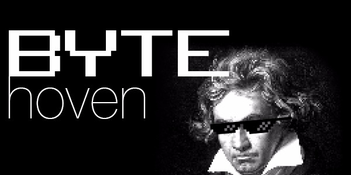
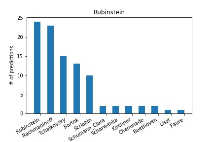
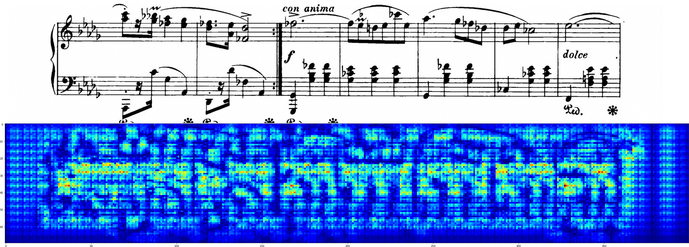

# Bytehoven - Sheet music recognition with ResNet50

This repository contains the resources used in the development of Bytehoven, a deep learning sheet music recognition model currently in development. [Please find the full tutorial here.](http://www.paulvangent.com/2017/12/07/deep-learning-music/) The current version recognises piano music from Bach, Beethoven, Brahms, Chopin, Grieg, Liszt, and Mozart.

Trained model weights are available under 'releases'. We'll keep training on more data and composers to increase Bytehoven's knowledge base.

Index:
<index>

# Dataset organisation and methods
Source material has been downloaded from the [Petrucci Music Library](http://imslp.org). Datasets have been generated by downloading all piano works from each composer, 
and splitting each piece into images of individual rows of music. For de Dev and Test set, full compositions were taken out of the training set (to prevent the net from
recognising thematic works or repeated phrases).

The net was trained for 100 epochs, starting with learning rate 0.001 which decayed linearly to 0 over epochs.

# Current Results
The current released model version scores 76.44% validation accuracy on the test set (98.23% train set, 73.41% dev set).

When evaluating difficult to classify composers, an interesting pattern arose with Rubinstein. Anton Rubinstein is often confused with Tchaikovsky and Rachmaninov:

This is especially interesting, since Rubinstein [was Tchaikovsky's composition teacher](https://en.wikipedia.org/wiki/Pyotr_Ilyich_Tchaikovsky#Civil_service;_pursuing_music), and Rachmaninov's [early compositional influence](https://en.wikipedia.org/wiki/Sergei_Rachmaninoff#Compositional_style) was Tchaikovsky, and who also expressed having Rubinstein as a role model.

Contemporaries Debussy and Saint-Saens are also confused by the model. Interestingly, these contemporary composers were not fans of [each other's work](https://en.wikipedia.org/wiki/Camille_Saint-Sa%C3%ABns#1900–21:_Last_years). Immortalised in the quotes:
Saint-Saens: "I have stayed in Paris to speak ill of Pelléas et Mélisande." (a Debussy opera)
Debussy: "I have a horror of sentimentality, and I cannot forget that its name is Saint-Saëns."
[source](http://janeheiress.blogspot.nl/2009/08/camille-saint-saens-where-have-you-been.html)

It seems these contemporary rivals may share more stylistic devices that they might have liked to admit, according to the classifications made by Bytehoven.

Lastly, the most impossible composer to classify is Clara Schumann: 

What is so difficult about classifying her work eludes me. She is often confused with Chaminade (the only other female composer in the set!) and Satie. Both were contemporaries of Clara in here later years, so there might have been some influence there.

# Included files

- datasets/Musicdata_Small.rar -- Dataset of small sized images (200*35px)
- datasets/Musicdata_Medium.rar -- Dataset of medium sized images (400*70px)
- resnet50.py -- ResNet50 architecture implemented in Keras
- run_resnet50.py -- Example to initiate training run

Releases:
- Release V0.1: bytehoven-7-weights.hdf5 -- Model weights trained on medium sized set with 7 composers (full training log included), reaching 99.5% validation accuracy on test set.
- Release V0.2: bytehoven-22-weights.hdf5 -- Model weights trained on 22 composers (training log and composer list included).

# Network activation and filter visualisation

Final network layer activation for two random pieces:

Beethoven:

Chopin:

Random filters visualised (filters lower in the image are deeper in the network):
