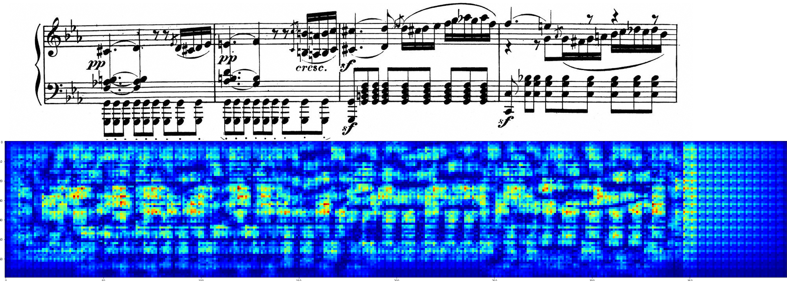
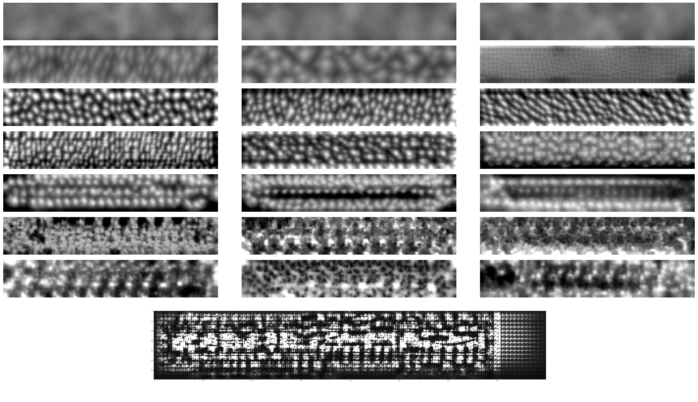

# Bytehoven - Sheet music recognition with ResNet50

This repository contains the resources used in the development of Bytehoven, a deep learning sheet music recognition model currently in development. [Please find the full tutorial here.](http://www.paulvangent.com/2017/12/07/deep-learning-music/) The current version recognises piano music from Bach, Beethoven, Brahms, Chopin, Grieg, Liszt, and Mozart.

Trained model weights are available under 'releases'. We'll keep training on more data and composers to increase Bytehoven's knowledge base.

# Dataset organisation and methods
Source material has been downloaded from the [Petrucci Music Library](http://imslp.org). Datasets have been generated by downloading all piano works from each composer, 
and splitting each piece into images of individual rows of music. For de Dev and Test set, full compositions were taken out of the training set (to prevent the net from
recognising thematic works or repeated phrases).

The net was trained for 100 epochs, starting with learning rate 0.001 which decayed linearly to 0 over epochs.

# Included files

- datasets/Musicdata_Small.rar -- Dataset of small sized images (200*35px)
- datasets/Musicdata_Medium.rar -- Dataset of medium sized images (400*70px)
- resnet50.py -- ResNet50 architecture implemented in Keras
- run_resnet50.py -- Example to initiate training run

Releases:
- Release V0.1: bytehoven-7-weights.hdf5 -- Model weights trained on medium sized set with 7 composers (full training log included), reaching 99.5% validation accuracy on test set.

# Network activation and filter visualisation

Final network layer activation for two random pieces:

Beethoven:

Chopin:

Random filters visualised (filters lower in the image are deeper in the network):
